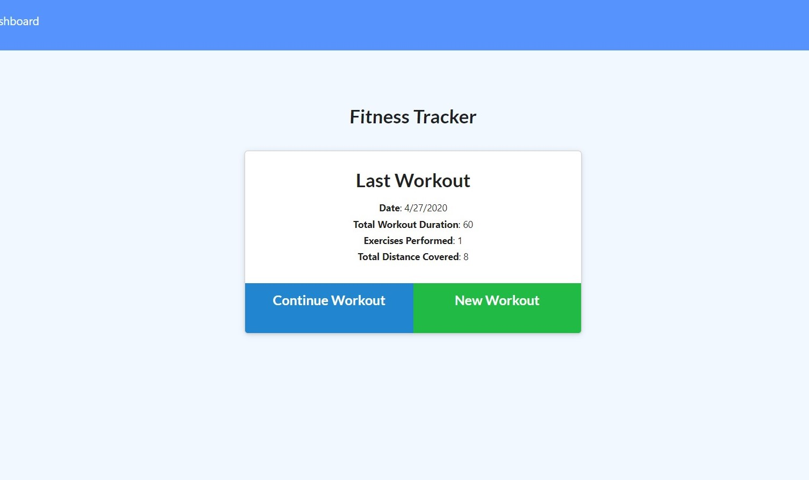
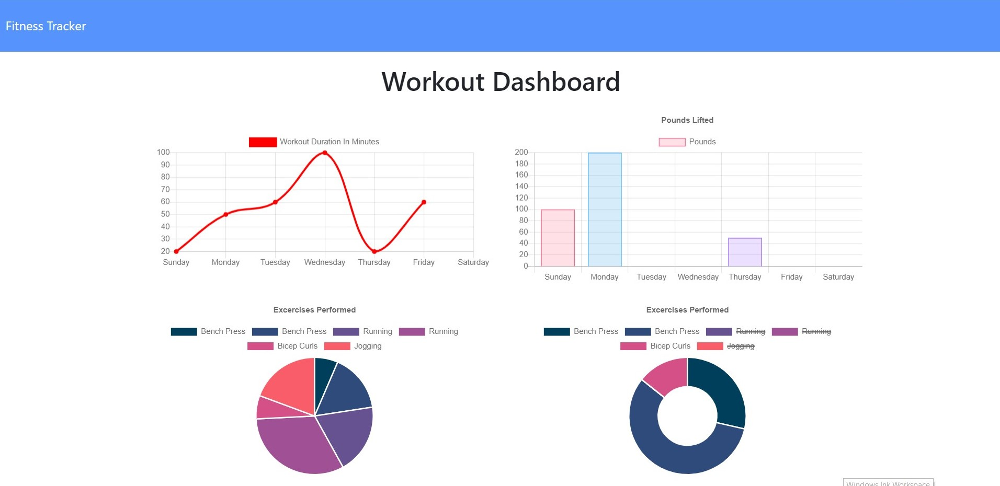
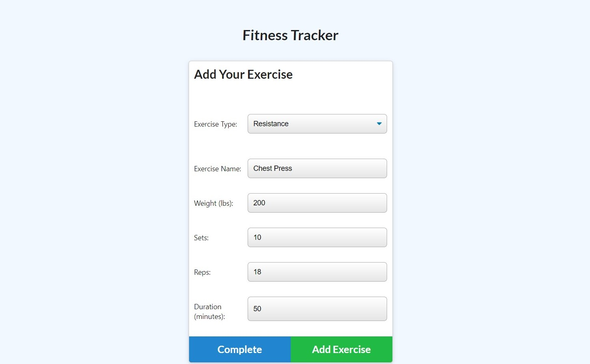

# Fitness Tracker #
## Use mongoDB, nodejs and express to build a fitness tracker. ##

This app tracks your everyday work out by categrories such as resistance and cardio. It records your work out into database and shows on the line chart for workout duration and and pie chart for resistance pounds. 

Please refer to the heroku deploy page here: https://sue-fit-tracker.herokuapp.com/

#### Please refer to the screenshots below to get a better idea: ####

